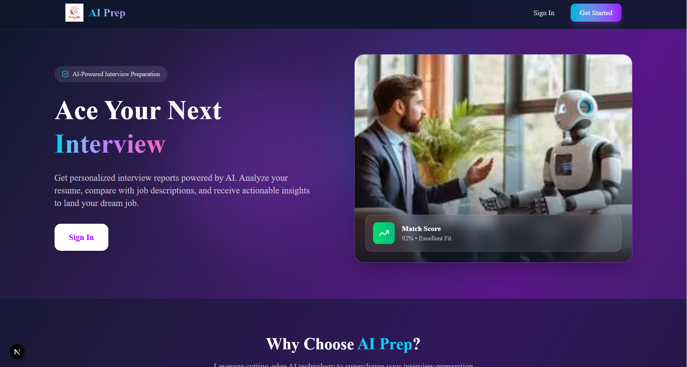
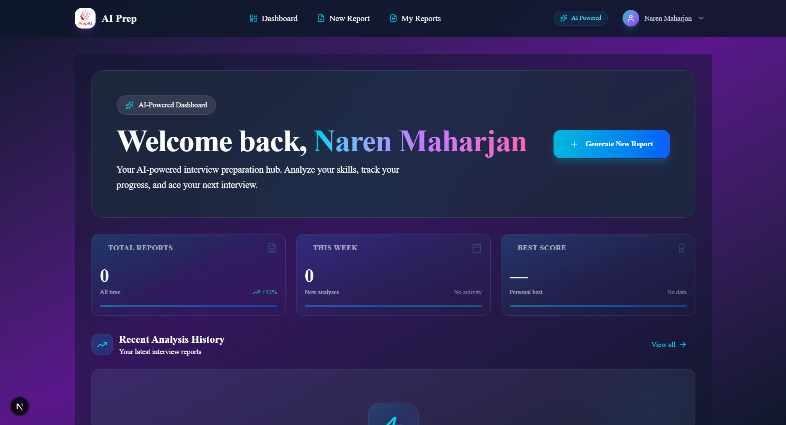

# AI Prep - Full-Stack AI Job Preparation Platform

A production-ready Gen AI application designed to help users bridge the gap between their current skills and their dream jobs. This platform simulates a real-world product where users can upload resumes, analyze job descriptions, detect skill gaps, and generate ATS-optimized resumes and interview questions using the Gemini API.

---

## 🎬 Demo Video

Watch the full demo on YouTube: [AI Prep Demo](https://youtu.be/Trv46aEX8RQ)..................................
-----

## 📸 Screenshots





---


## 🚀 Key Features

### 🔐 Secure Authentication & Authorization

- **JWT Implementation:** Robust user sessions using JSON Web Tokens
- **Token Blacklisting:** Enhanced security for logout and session management to prevent unauthorized access
- **Protected Routes:** Middleware-based route protection ensuring only authenticated users can access dashboard and reports
- **Auth Redirects:** Automatic redirect of authenticated users away from login/register pages

### 📄 Resume Processing & Analysis

- **Skill Extraction:** Automated parsing of uploaded resumes to identify core competencies
- **Skill Gap Detection:** AI-driven analysis comparing user resumes against specific job descriptions
- **ATS Optimization:** Generation of resumes designed to rank higher in Applicant Tracking Systems
- **PDF Upload:** Support for PDF resume uploads with file validation
- **PDF Download:** Professional PDF resume generation for download

### 🤖 AI-Powered Interview Prep

- **Dynamic Question Generation:** Tailored interview questions based on the user's background and the target role
- **Gemini API Integration:** Leverages Google's state-of-the-art AI for natural language processing
- **Interview Reports:** Comprehensive interview preparation reports with recommendations

### 🛠 Dynamic PDF Creation

- **Puppeteer Integration:** High-quality, professional PDF generation for resumes directly from the web application

### 📊 Dashboard & Reports

- **Personalized Dashboard:** User-specific dashboard with interview preparation insights
- **Report Management:** View, generate, and manage interview preparation reports
- **Report Details:** Detailed analysis of each interview report with skill gap analysis

---

## 💻 Tech Stack

### Frontend

| Technology          | Purpose                                                   |
| ------------------- | --------------------------------------------------------- |
| **Next.js 16**      | React framework with App Router                           |
| **React 19**        | UI library for building user interfaces                   |
| **TypeScript**      | Type-safe JavaScript development                          |
| **Redux Toolkit**   | State management for authentication and application state |
| **shadcn/ui**       | Beautiful, accessible UI components built with Radix UI   |
| **Tailwind CSS**    | Utility-first CSS framework                               |
| **Lucide React**    | Icon library                                              |
| **Sonner**          | Toast notifications                                       |
| **React Hook Form** | Form handling with validation                             |
| **Zod**             | Schema validation                                         |
| **Axios**           | HTTP client for API requests                              |
| **Recharts**        | Chart library for data visualization                      |
| **date-fns**        | Date manipulation utilities                               |

### Backend

| Technology            | Purpose                          |
| --------------------- | -------------------------------- |
| **Node.js**           | JavaScript runtime               |
| **Express.js**        | Web application framework        |
| **MongoDB**           | NoSQL database with Mongoose ODM |
| **JWT**               | JSON Web Token authentication    |
| **Bcryptjs**          | Password hashing                 |
| **Cookie Parser**     | Cookie parsing middleware        |
| **CORS**              | Cross-origin resource sharing    |
| **Zod**               | Input validation                 |
| **Express Validator** | Additional request validation    |

### AI & APIs

| Technology     | Purpose                                           |
| -------------- | ------------------------------------------------- |
| **Gemini API** | Google's generative AI for NLP tasks              |
| **Google AI**  | AI-powered skill analysis and question generation |

### Development Tools

| Technology  | Purpose                       |
| ----------- | ----------------------------- |
| **Vite**    | Next.js bundler (via Next.js) |
| **ESLint**  | Code linting                  |
| **PostCSS** | CSS processing                |
| **Git**     | Version control               |

---

## 🏗 Project Structure

```
Job_preparation_AI/
├── backend/                    # Express.js backend server
│   ├── src/
│   │   ├── config/             # Database configuration
│   │   ├── controllers/        # Route controllers (auth, interview)
│   │   ├── middleware/         # Custom middleware (auth, file)
│   │   ├── models/             # Mongoose models (User, InterviewReport, Blacklist)
│   │   ├── routes/             # API route definitions
│   │   ├── services/           # Business logic (AI service)
│   │   ├── validations/        # Input validation schemas
│   │   └── app.js              # Express app setup
│   ├── package.json
│   └── .env                    # Environment variables
│
├── frontend/                   # Next.js 14 frontend
│   ├── app/                   # App Router pages
│   │   ├── dashboard/          # Protected dashboard routes
│   │   │   ├── generate/       # Generate new report
│   │   │   ├── reports/       # View all reports
│   │   │   └── reports/[id]/ # Individual report view
│   │   ├── login/              # Login page
│   │   ├── register/           # Registration page
│   │   ├── layout.tsx         # Root layout
│   │   ├── page.tsx           # Landing page
│   │   └── globals.css        # Global styles
│   │
│   ├── components/
│   │   ├── auth/              # Auth components (ProtectedRoute, AuthRedirect)
│   │   ├── ui/                # shadcn UI components
│   │   └── ReduxProvider.tsx  # Redux provider
│   │
│   ├── hooks/                 # Custom React hooks
│   ├── lib/                   # Utilities (API client, utils)
│   ├── services/              # API service functions
│   ├── store/                 # Redux store configuration
│   │   └── slices/            # Redux slices (auth, interview)
│   ├── types/                 # TypeScript type definitions
│   ├── middleware.ts         # Next.js middleware for route protection
│   ├── next.config.ts         # Next.js configuration
│   └── package.json
│
└── readme.md                  # Project documentation
```

---

## 🔄 Project Workflow

### 1. User Registration & Authentication

```
User → Register Page → API Call → Backend Validation →
Create User → Generate JWT → Return Token → Store in localStorage/Cookie →
Redirect to Dashboard
```

### 2. Resume Upload & Processing

```
Dashboard → Upload Resume (PDF) → API Call → Backend →
Gemini API Analysis → Extract Skills → Return Analysis →
Store Report in MongoDB
```

### 3. Job Description Analysis

```
Dashboard → Enter Job Description → API Call → Backend →
Gemini API Analysis → Compare with Resume → Identify Skill Gaps →
Generate Recommendations → Store Report
```

### 4. Interview Question Generation

```
Dashboard → Select Report → Generate Questions → API Call →
Gemini API → Generate Tailored Questions → Display to User
```

### 5. PDF Resume Generation

```
Dashboard → Select Report → Generate Resume → Backend →
Puppeteer → Render HTML to PDF → Return PDF → User Download
```

### 6. Route Protection Flow

```
User Access /dashboard → Middleware Check →
Has Valid Token? → Yes: Allow Access / No: Redirect to /login

User Access /login (Authenticated) → Middleware Check →
Has Valid Token? → Yes: Redirect to /dashboard / No: Allow Access
```

---

## 🛠 Installation & Setup

### Prerequisites

- Node.js (v18+)
- MongoDB Atlas account (or local MongoDB)
- Google Gemini API key

### Environment Variables

Create a `.env` file in `backend/src/`:

```env
MONGODB_URI=your_mongodb_connection_string
JWT_SECRET=your_jwt_secret_key
GEMINI_API_KEY=your_gemini_api_key
PORT=5000
NODE_ENV=development
```

### Installation Steps

1. **Clone the repository:**

```bash
git clone https://github.com/your-username/ai-prep.git
cd ai-prep
```

2. **Install Backend Dependencies:**

```bash
cd backend
npm install
```

3. **Install Frontend Dependencies:**

```bash
cd ../frontend
npm install
```

4. **Run the Application:**

```bash
# Terminal 1 - Backend (from backend folder)
npm start
# Server runs on http://localhost:5000

# Terminal 2 - Frontend (from frontend folder)
npm run dev
# Application runs on http://localhost:3000
```

5. **Access the Application:**
   Open http://localhost:3000 in your browser

---

## 📱 API Endpoints

### Authentication

| Method | Endpoint             | Description         |
| ------ | -------------------- | ------------------- |
| POST   | `/api/auth/register` | Register a new user |
| POST   | `/api/auth/login`    | Login user          |
| GET    | `/api/auth/logout`   | Logout user         |
| GET    | `/api/auth/me`       | Get current user    |

### Interview

| Method | Endpoint                     | Description                        |
| ------ | ---------------------------- | ---------------------------------- |
| POST   | `/api/interview/analyze`     | Analyze resume and job description |
| GET    | `/api/interview/reports`     | Get all reports for user           |
| GET    | `/api/interview/reports/:id` | Get specific report                |
| DELETE | `/api/interview/reports/:id` | Delete a report                    |

---

## 🔐 Security Features

- **JWT Authentication:** Stateless authentication using JSON Web Tokens
- **Password Hashing:** Passwords are hashed using bcrypt before storage
- **Token Blacklisting:** Invalidated tokens are blacklisted to prevent reuse after logout
- **HTTP-Only Cookies:** Secure cookie storage for authentication tokens
- **CORS Protection:** Configured cross-origin resource sharing
- **Input Validation:** Zod schemas for request validation
- **Route Protection:** Next.js middleware for protected routes

---

## 📄 License

This project is licensed under the MIT License.

---

## 👤 Author

Developed with ❤️ using modern web technologies.
